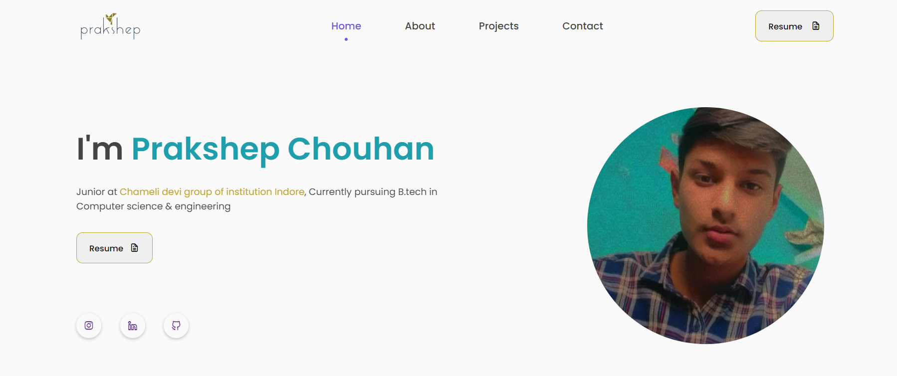

# Responsive Portfolio Website

My personal portfolio website https://prakshep0308.github.io/Portfolio_website/ which features my skills, education, projects, internships as well as my resume.

## Screenshots

## Built With

This project was built using these technologies.

1. HTML
2. CSS
3. JavaScript
4. Bootstrap

## Features

- Responsive Personal Portfolio Website Using HTML CSS & JavaScript
- Smooth scrolling in each section.
- Compatible with all mobile devices and with a beautiful and pleasant user interface.

[def]: ../README_img.png
